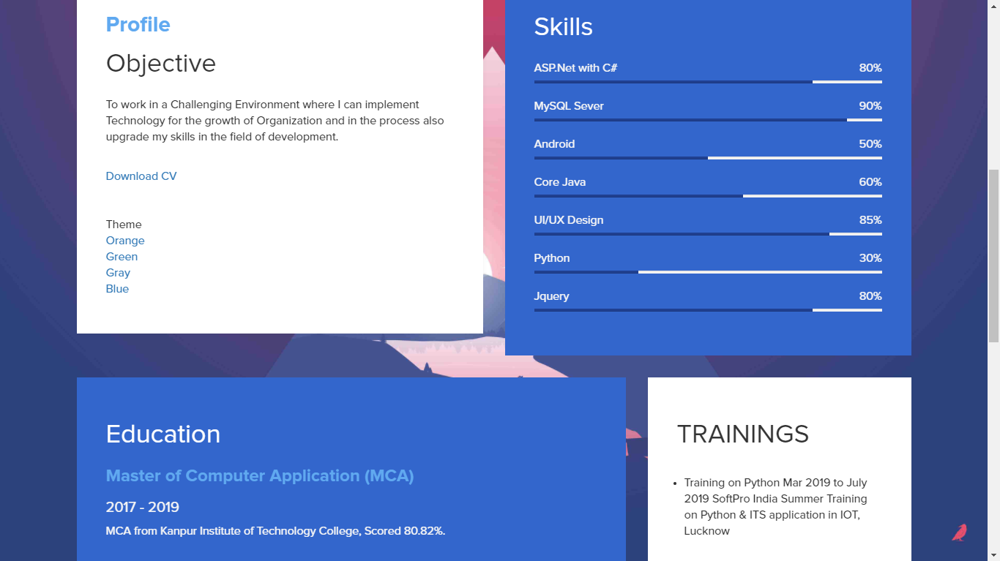
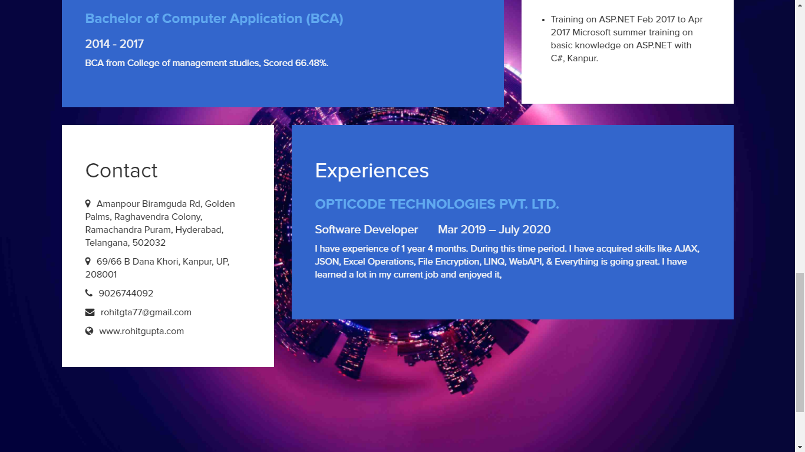

# Responsive Resume
 A simple html page with a lot of bootstrap and font awesome just to create a resume template. Edit your details and try modify the bootstrap classes, color or icons to have version of a resume. <a href="https://rohitgta77.github.io/myResume/">Click here</a> to visit my profile.
 
 

